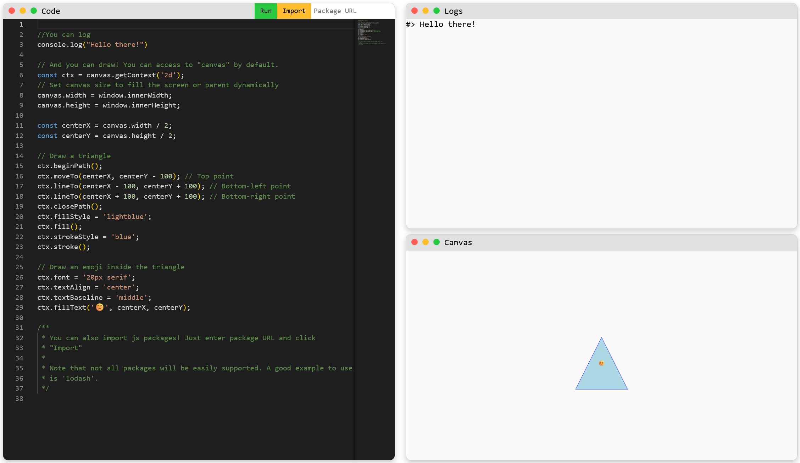

# 🚀JSPlay - Browser-Based JavaScript IDE – Run, Log, and Draw in Your Browser  

You know those time when you just want to run some JS? here you are.

 

## ✨ Overview  
This **lightweight, browser-based JavaScript IDE** lets you write, execute, and debug JavaScript code directly in your web browser. It includes built-in support for **console logging** and **canvas rendering**, making it perfect for learning, rapid prototyping, and interactive coding.  

- 🔹 **No installation required** – Runs entirely in the browser  
- 🔹 **Live console logging** – View logs in real-time  
- 🔹 **Canvas drawing support** – Create visualizations and animations  
- 🔹 **Open source** – Free to use and contribute  

## 🚀 Features  
- **🖥️ Code Editor** – Powered by Monaco, with syntax highlighting & autocompletion  
- **📜 Console Output** – Displays logs, errors, and warnings in real time  
- **🎨 Canvas Rendering** – Built-in support for `canvas` API to draw graphics  
- **📦 Import Libraries** – Load external JavaScript libraries via CDN  
